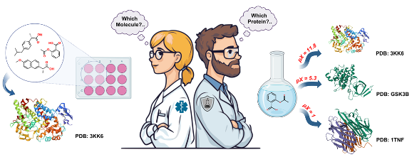

# Chemistry Meets Biology: Cross-Disciplinary Database Evaluation for Drug Research

  

Supporting information and files for the article **Chemistry Meets Biology: Cross-Disciplinary Database Evaluation for Drug Research**  
Full article could be accessed by the [following link](https://pubs.acs.org/doi/full/10.1021/acs.jcim.5c00021).  
For further details see jupyter notebook **Survey_analysis.ipynb**

## Data files:
  * **data/Survey_raw.csv** – raw google sheet results from google forms
  * **data/TAR_database.csv** – explicit information about investigated targets
  * **data/cpd_database.csv** – explicit information about investigated compounds
  * **data/SURVEY_answers.csv** – preprocesses **data/Survey_raw.csv** into convenient form
